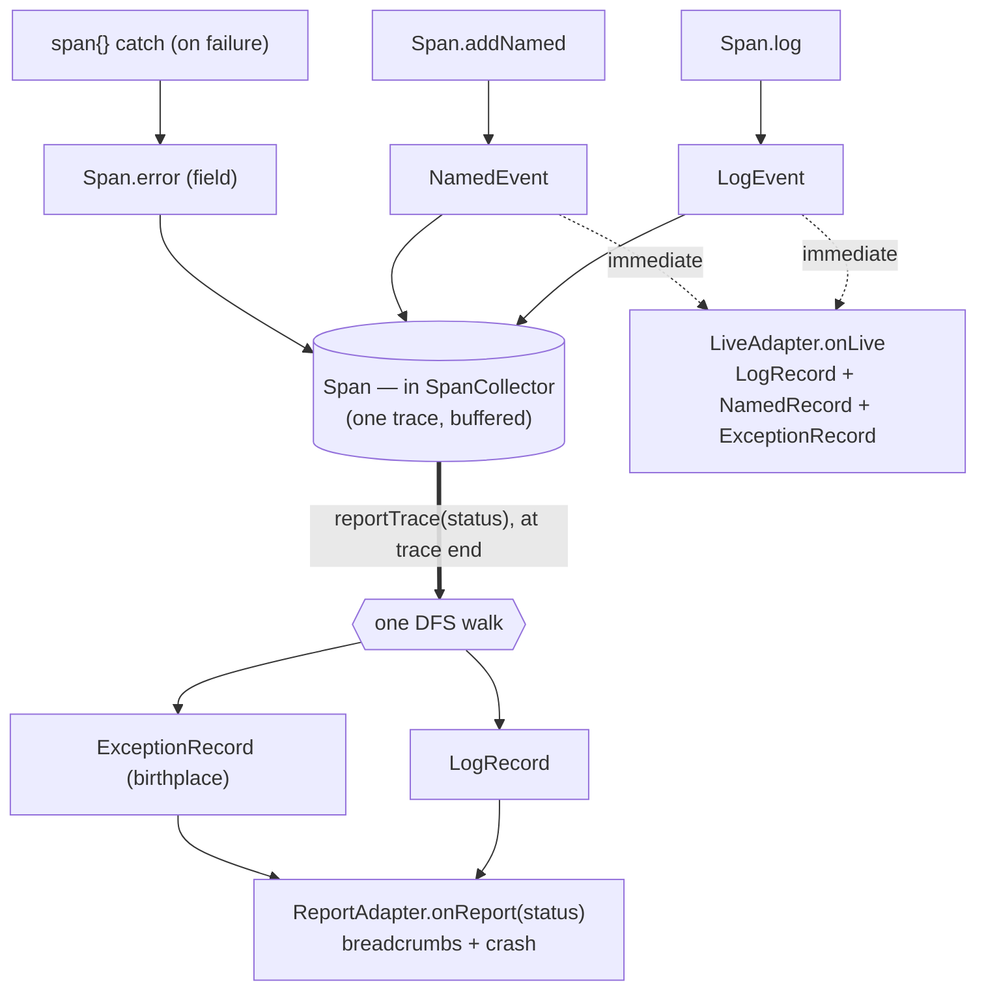
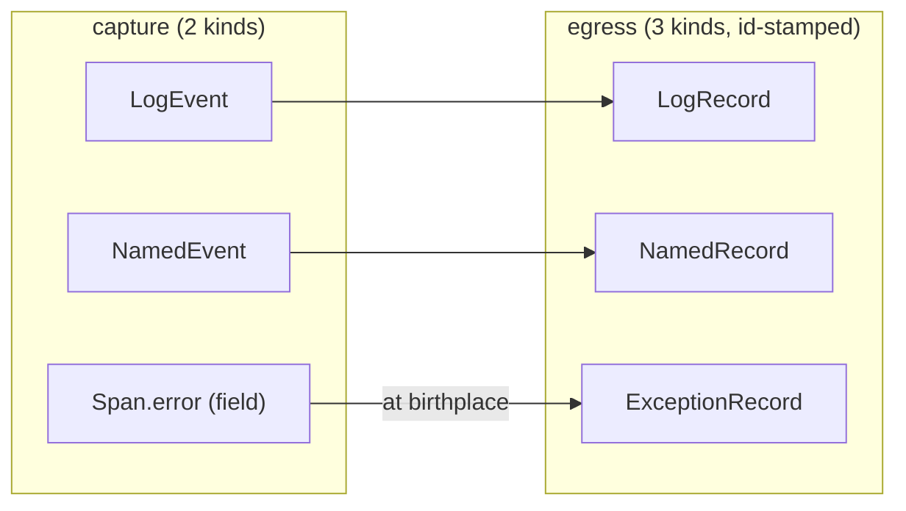
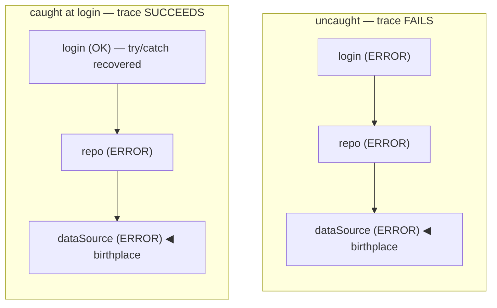

# kotrace — architecture

How the pieces fit and **why** they are shaped the way they are. [README.md](README.md) is the
what-and-how-to-use; this is the reference for the design decisions behind it — read it before changing the
data model, the fan-out, or the boundary rules.

---

## 1. Scope, and what kotrace deliberately is not

kotrace is a **tiny, in-process, coroutine-native span tracer** for Kotlin/JVM. It builds a per-flow tree
of spans over `CoroutineContext`, marks the failing path, and fans the finished tree out to consumer
**adapters** — while emitting a **W3C `traceparent`** header so a client trace stitches to a backend one
with **no OpenTelemetry SDK** on either side.

It is scoped **narrowly on purpose**. The narrowness is what lets it stay small and make choices a
general-purpose observability SDK cannot:

| kotrace does | kotrace does **not** |
|---|---|
| one process, one call tree per flow | distributed tracing across services |
| buffer the tree, decide reporting at the end (**tail**) | head sampling / per-span streaming |
| span events bound to an operation | standalone logs (no active span → no-op) |
| keep the live `Throwable` for a crash reporter | serialize everything for a wire exporter |
| a `traceparent` on the wire as the upgrade seam | its own backend / collector protocol |

The **wire format is the contract**: an OTel upgrade later is additive (§9).

### At a glance



Capture is **normalized** (events on the span, id stored once); egress is **denormalized** (flat,
id-stamped records). Live fans out per-event as it happens; report fans the whole tree out once at the end.

Which events reach the **report** is one declared predicate — `SpanEvent.reportable()` (`Report.kt`),
exhaustive over the sealed `SpanEvent`: `LogEvent` and `ExceptionEvent` yes, `NamedEvent` no (live-only). It
gates *whether*, not *how* — `reportTrace` still collects a log per span and the exception at the birthplace. It
is not an implicit `filterIsInstance`: a future event kind fails to compile until it classifies itself
there, so it can never be silently dropped from a failure report.

### Vocabulary

The canonical words. kotrace **owns** these — a consumer (e.g. the Camailux `:core:common` facade)
references them and adds its own binding terms on top; it does not redefine them. The four verbs never
interchange.

| Term | Precisely |
|---|---|
| **tracing** | the concern / this library — never a runtime object. |
| **trace** | **one call tree** = one `trace_id`, per flow. The verb that opens a **span** within it is `span(name){}` — named for the node it opens, not the tree (ADR-003). |
| **span** | **one node** (`Span`) — a name, a status, `attributes`, `events`, an optional `error`, a parent. Entity, not value (§2). |
| **operation** | the owning **`Span.name`** at egress — its label as the flat **join key** on every `TraceRecord` and `toJson` column. `name` = the in-memory field; `operation` = that value as the wire/backend-join key (OTel-aligned). A **wire contract** (§2), and distinct from `NamedRecord.name` (the *event*'s name). |
| **record** | a flat **egress line** (`TraceRecord`), lifted off a span at fan-out. Three kinds ↓. |
| **log** | a **breadcrumb** event (`Span.log` → `LogEvent` → `LogRecord`) — a line bound to a span. |
| **event** (named) | a **named / analytics** occurrence (`Span.addNamed` → `NamedEvent` → `NamedRecord`, OTel `addEvent` shape). |
| **exception** | the **birthplace crash** — `Span.error` (a field, §8), surfaced only at egress as `ExceptionRecord`; bypasses every policy gate. |
| **report** | the **tail** fan-out at trace end (`ReportAdapter.onReport(status)`) — buffered tree, breadcrumbs + crash, gated by status. |
| **live** | the **per-event** fan-out as it happens (`LiveAdapter.onLive`) — immediate, ungated by trace status. |
| **status** | `SpanStatus` = one node's outcome; `TraceStatus` = the whole trace's verdict (`OK`/`ERROR`/`CANCELLED`). Separate on purpose (§2). |
| **adapter** | a consumer sink (`TraceAdapter`) — `ReportAdapter` (tail) or `LiveAdapter` (per-event). |

---

## 2. The data model

Two levels, deliberately distinct: **capture** (rich, span-local, cheap to buffer) and **egress** (flat,
identity-stamped, adapter-ready). The tracer normalizes at capture and denormalizes only at the boundary.

### `Span` — the node (an entity, not a value)

A `Span` is one unit of work; a tree of them linked by `parentId` is the call path. It is a **plain
`class`, not a `data class`**:

- It has **identity** (`spanId`, a 64-bit random hex) and **mutates over its life** (`status`, `endNanos`,
  `error` flip after it opens — `status`/`endNanos` via a safely-published atomic pair, ADR-006). Value
  semantics are wrong for it — a generated `hashCode` over that mutable state
  would shift while the span sits in a collection; `copy()` would mint a second span sharing one `spanId`;
  `equals` over a `Throwable` is meaningless. Two spans are the same span iff they are the same instance.
- The **exception lives here as a field** (`error: Throwable?`), *not* as an event — see §8.

`spanId`/`traceId` uniqueness is **probabilistic, not enforced** (random, no registry): within one trace
(a handful of spans) a 64-bit collision is ~0, matching the W3C guarantee.

A span carries **two** string→string channels, split by role (ADR-001):

- **`attributes`** — **fixed filter dimensions**, an immutable `Map` set at birth (`layer=http`). The
  *only* per-span input a `TracePolicy.acceptsSpan` gate reads. Immutable, so a gate decides identically at
  live emit and report — no dependence on when it runs.
- **`info`** — **emitted info**, a mutable channel written late via `putInfo` (`http.status`, known only
  once the response returns). It rides onto every `TraceRecord` as payload but is **never** a filter key.

The split is a correctness invariant, not tidiness: a value known only late (a result) cannot be a filter
input, because at live emit its presence varies with event order — a policy filtering on it would race. So
late values are info (payload), fixed birth values are attributes (filter). See §4 and ADR-001.

### `SpanEvent` — a capture-time occurrence (sealed)

```
sealed interface SpanEvent { atNanos }
  ├─ LogEvent(level, message, sensitive)   // a log line — Span.log
  └─ NamedEvent(name, attributes)          // an OTel event.name occurrence — Span.addNamed
```

An **event is the umbrella**; a log line is one *kind* of it, a named/analytics occurrence another. The
name is `SpanEvent`, not `SpanLog`, precisely to leave room for the non-log kind. Events are the
**normalized** form: the span's identity lives once on the `Span`, so buffering N events costs no repeated
id. Most traces succeed and their events are discarded — buffering the lean form, not id-stamped records,
is the tail-efficiency win.

`sensitive` is a **capture-site classification** (this message carries user data — a captured body), **not**
a routing decision. Where it goes is a policy decision (§4); the flag only says *what it is*.

### `TraceRecord` — an egress line (sealed)

```
sealed interface TraceRecord { traceId, spanId, parentId, operation, atNanos, info }
  ├─ LogRecord(attributes, message, sensitive)  // from a LogEvent
  ├─ NamedRecord(name, attributes)              // from a NamedEvent
  └─ ExceptionRecord(throwable)                 // from the birthplace exception — no event counterpart
```

The **denormalized** form: flat, with the identity/join fields stamped on (a raw `SpanEvent` carries
none). This is the **contract an adapter sees** — the rich `Span` never crosses to a consumer, so a
consumer never depends on kotrace's internal node shape.

**`operation` vs `name` — the egress rename** (defined in §1 Vocabulary). `operation` is the owning
`Span.name`, carried on every record as the flat join key; it is a `toJson` column, so it is a **wire
contract** a backend joins on. It collides deliberately with `NamedRecord.name`, which is the *event*'s
name (`NamedEvent.name`): on a `NamedRecord`, `operation` = the span, `name` = the event. Renaming
`operation`→`name` would both alias the event name and break the join wire — so both stay.

Capture has **two** kinds, egress has **three**: `ExceptionRecord` is synthesized from `Span.error` at the
birthplace and has no `SpanEvent` counterpart. That asymmetry is honest — it records that the exception is a
span *outcome* (field), surfaced as a record only at fan-out. Mapping:



---

## 3. Propagation and boundaries — three context elements

kotrace hangs three things on the `CoroutineContext`, each a `ThreadContextElement` with a `ThreadLocal`
mirror. The mirror is what lets **non-suspend code on a coroutine's thread** (an OkHttp factory, a Room
callback) read them without a `coroutineContext` handle.

| Element | Carries | Read via | Decides |
|---|---|---|---|
| `SpanContext` | the active span | `currentThreadSpan()` (suspend: `currentSpan()`) | who is a new span's **parent** |
| `SpanCollector` | every span in one trace | `currentThreadCollector()` | which tree is **collected** |
| `TraceConfig` | the consumer's adapters (+ derived capture levels) | `currentThreadConfig()` (suspend: `currentConfig()`) | how the trace **fans out** |

These are **three separate boundaries**, decoupled on purpose: a span can have a `traceId` (identity) but no
collector (untraced-but-identified); the config is orthogonal to both. Why a `ThreadContextElement` and not
a bare `ThreadLocal`: a coroutine resumes on different threads, so the mirror must be re-established on every
resume and restored on the way out — that is exactly the `updateThreadContext`/`restoreThreadContext`
contract. `AbstractCoroutineContextElement` supplies only the `key` plumbing; it could be hand-written.

### `SpanCollector` is per-trace and ephemeral

One collector = one trace, seeded at the root (`withContext(collector)`), dead when the root returns
(fan-out, then GC). There is **no global registry** accumulating traces — that is what keeps memory flat and
what makes kotrace's tail decision safe (§4): it buffers exactly one flow at a time.

### The failing path, and why `status` propagates

`span { }` is instrumentation: it observes and **rethrows**, never swallows. On the way up, *each* enclosing
`trace`'s catch marks its span `ERROR` and rethrows. So the **whole ancestor chain** the exception passed
through uncaught is marked — and it stops exactly where a `try/catch` handled it. This is runtime
control-flow information: a deep-search over the finished tree **cannot** distinguish "error handled and
recovered" (trace OK) from "error escaped" (trace failed), because both leave the same error at the
birthplace. Propagated `status` records where the exception actually stopped; that is why it must be set as
the exception travels, not derived afterwards.



The throwable is born at `dataSource` and marks each span its rethrow passes through — until a `try/catch`
stops it. Same error at the birthplace in both trees; only propagated `status` (login OK vs ERROR) tells the
two apart. A read-time search over the finished tree cannot.

`error` (the `Throwable`) is also set on each ancestor by the same catch, but only the **birthplace**'s is
emitted; the redundant ancestor copies are deduped at read (§ birthplace). It is a field, not an event, for
the reasons in §8.

### Birthplace

The **birthplace** is the deepest throwable-bearing `ERROR` span on a branch — `exception != null && no
descendant carries a throwable` (`isBirthplaceAmong`, ADR-005). Only there is the throwable emitted (an
`ExceptionRecord`), so it appears once, not once per ancestor. Gating on the throwable — not merely "no
child errored" — is what stops a throwable-less `ERROR` leaf (a bridge span ended `end(ERROR, null)`, e.g. an
OkHttp 500 that returned) from shadowing an ancestor's real crash out of the report. `report` is the sole
birthplace authority; there is no separate public helper. The birthplace record **bypasses every fan-out
gate** — a filter can never swallow the crash cause.

---

## 4. The one fan-out path

There is a **single** fan-out mechanism; the consumer supplies all policy through **adapters**. Many
adapters = many independent routes off one trace, with no core change.

```
sealed interface TraceAdapter { policy: TracePolicy }
  ├─ LiveAdapter   { onLive(record) }                       // per-event, as it happens
  └─ ReportAdapter { onReport(status, records: Sequence) }  // whole tree, at the end

interface TracePolicy {
  acceptsSpan(span): Boolean        // per-span breadcrumb filter — reads span.attributes ONLY (fixed,
                                    //   birth-set); never span.info (late) — the race-free invariant, ADR-001
  acceptsEvent(event): Boolean      // per-event filter over SpanEvent (e.g. a "level" attribute threshold)
  acceptsSensitive: Boolean         // receive sensitive records? default false — fail-closed
}
```

- **Role, not flag.** An adapter *is* a `LiveAdapter` and/or a `ReportAdapter`; membership (`is LiveAdapter`)
  replaces any `wantsLive` flag, so the two can never fall out of sync.
- **Self-gate, lazily.** `onReport` receives the `status`, so a failure-only adapter writes
  `if (status == TraceStatus.OK) return`; `records` is a lazy `Sequence`, so a skipped outcome forces no walk or
  allocation. There is no separate `reports(status)` predicate — it would just re-hand the status the
  callback already has.
- **One walk, N views.** `SpanCollector.reportTrace(status)` walks the tree once into `(span, record)` entries;
  each adapter gets a lazy view filtered by *its* policy. `ExceptionRecord` always passes; a `LogRecord`
  passes `acceptsSpan(span)` ∧ `acceptsEvent(event)` ∧ (`!sensitive` ∨ `acceptsSensitive`). `NamedRecord`s
  are **not** in the report path — analytics is a live concern (below).

### Live vs report — two timings, one mechanism

| | Emitted | Kinds | Trigger |
|---|---|---|---|
| **Live** (`onLive`) | per event, immediately | `LogRecord`, `NamedRecord`, `ExceptionRecord` | any registered `LiveAdapter` |
| **Report** (`onReport`) | once, at trace end | `LogRecord`, `ExceptionRecord` | `reportTrace(status)` |

A **named/analytics** event fires **live** (on success too), never tail-buffered for failure — that is the
right lifecycle for product data. A **log breadcrumb** rides both: live if a live adapter is watching, and
buffered to the end report. The **exception** rides both too: live as it is thrown (a watch sees it climb
the tree, deepest first, ungated by trace status), and once at report — deduped to the birthplace, gated on
failure. Live is awareness; report is the crash verdict (§8). Building the live record is skipped
entirely when no live adapter is registered, so a production report-only trace pays nothing per event.

### Tail, not head

Because the whole tree is buffered in-process, kotrace decides reporting **after** seeing the outcome — a
tail decision, made for free by the buffer it already keeps. It never has to sample blind at the source the
way a streaming SDK does. The cost is holding one flow's spans in RAM until it ends; the ephemeral,
one-trace `SpanCollector` (§3) keeps that bounded.

### Config is immutable, var-free

`TraceConfig(adapters)` is an immutable context element. `liveAdapters`/`reportAdapters` are partitioned
once at construction, so the hot path reads a precomputed list. There is **no capture gate** (ADR-002):
the event verbs store unconditionally and filtering happens once, per adapter, at fan-out (`policy.accepts`
in `emit` live, `viewOf` at report). Registering a DEBUG-wanting adapter is still the only step needed to
surface DEBUG — it decides delivery, not storage. A rejected event never resolves its lazy message: `emit`
filters *before* building the record, and `viewOf` maps only accepted entries, so a message builds only
when some adapter accepts it. The `ExceptionEvent`, like every event, is appended unconditionally, so a
layer-filtered span still reports its birthplace crash — and a live adapter sees the crash the moment it is
thrown, not only at fan-out.

---

## 5. Capture

**Opening spans.** `span(name, attributes) { }` opens a child (suspend, closes on return); `startSpan(name,
attributes)` does the same for non-suspend code off the coroutine frame (closed with `Span.end()`). Both
mint the span through one private `createSpan(parent, …)` — the parent resolved from the coroutine context
(`span`) or the `currentThreadSpan()` mirror (`startSpan`). `startSpan`/`end` are the non-suspend bridge,
gated behind the `@NonSuspendTracingBridge` opt-in (`ERROR`) because — unlike `span` — they do not install
the span into the coroutine context, so a nested suspend `span` would misparent; the OkHttp bridge opts in
at its one legitimate site (ADR-003). The `attributes` a span is opened with are its fixed filter
dimensions (§2, ADR-001); kotrace ships the mechanism and names no layers — a consumer folds its own layer
vocabulary in at the call site (or, like Camailux, behind its own thin wrappers).

**Event verbs are all extensions on `Span`** — `Span.log`, `Span.addNamed`, `Span.addException` — one
uniform shape; there is no ambient no-receiver form. The caller resolves the span with a getter and calls
the verb on it. Every verb stores its event unconditionally — there is no capture gate (§4, ADR-002); the
log message lambda is still not built for an event no adapter accepts, because `emit`/`viewOf` resolve it
only at fan-out, so a filtered log costs nothing to build.

| Getter | For | Reads |
|---|---|---|
| `suspend currentSpan()` | a suspend caller | `coroutineContext[SpanContext]` (source of truth) |
| `currentThreadSpan()` | non-suspend code on the coroutine's thread (OkHttp/Room bridge) | the ThreadLocal mirror |
| a span **held directly** | a bridge that carries the span across a thread boundary | — (already in hand) |

So a suspend caller writes `currentSpan()?.log(level) { }`; a non-suspend bridge writes
`currentThreadSpan()?.log { }` or `heldSpan.log { }`. `addException` is the same shape — see §8.

kotrace stays generic: `addNamed` names no "analytics" — the meaning (consent, destination) lives in the
consumer's `LiveAdapter`. To surface one safe field from a sensitive body, log it as a **separate
non-sensitive** `LogEvent`/`NamedEvent` at the layer that parsed it — never by un-marking the body.

---

## 6. The wire — `traceparent`

`Span.toTraceparent()` renders the W3C `00-<trace_id>-<span_id>-<flags>` header. This is the cross-process
boundary: a client span emits it, a backend continues the **same** `traceId`, and the two stitch with no
shared SDK. `TraceRecord.toJson()` renders a one-line snake_case record for a JSON log pipeline (ELK/Loki)
to ingest `trace_id`/`span_id` as queryable fields, with `attributes`/`info` nested under their own objects
(ADR-004) — the machine, PII-safe counterpart to the unredacted, `@UnredactedTraceRead`-gated `renderTree`
(ADR-008).

---

## 7. Integrations (separate modules)

The core is pure Kotlin (`kotlinx-coroutines` only). Client/DB glue ships as opt-in modules so a Ktor or
pure-JVM consumer drags neither:

- **`kotrace-okhttp`** — `TracingCallFactory` opens the HTTP span at `newCall` **on the coroutine thread**
  (where `currentThreadSpan()`/`currentThreadCollector()`/`currentThreadConfig()` still resolve) and tags it on the request;
  `TracingInterceptor` reads the tag **on OkHttp's thread**, writes `traceparent`, and reflects
  status/body back. The split exists because the interceptor cannot see the coroutine context — the tag is
  the bridge. Captured bodies are logged as **`sensitive`** events.
- **`kotrace-room`** — logs each query's SQL template (never the bound args) onto the active span, resolved
  via the `currentThreadSpan()` ThreadLocal (Room runs the suspend query under the caller's coroutine).

---

## 8. The exception as a timeline `ExceptionEvent`

> **Note (drift + amendment).** This section originally argued the exception should be a `Span.error`
> *field*, not an event. The implementation went the other way: the crash is an `ExceptionEvent` appended to
> `Span.events` (`TraceException.kt`) — there is no `Span.error` field. The reasoning below is rewritten to
> the shipped design. The one property the field-form was chosen for — dedup — is preserved by topology at
> read time, not by overwrite.

The exception is a span **timeline event**, recorded by `trace`'s catch and reconciled at read:

1. **Always recorded, and live as it is thrown.** `addException` appends unconditionally — like every event
   verb, there is no capture gate (ADR-002) — so a level or layer filter never drops a crash. It also emits
   to live adapters, so a debug watch sees the throwable the moment it unwinds — awareness, distinct from the
   crash verdict.
2. **Paired with `status`.** `status` *is* a field (it propagates, §3); the catch sets it alongside appending
   the `ExceptionEvent`, so the two describe the same span outcome together.
3. **One per span at report, deduped by topology.** The same throwable is re-recorded up the whole failing
   path; at fan-out only the birthplace (deepest throwable-bearing ERROR) `ExceptionRecord` is kept (`isBirthplaceAmong`, ADR-005).
   Live does **not** dedup — it shows the full climb (deepest first), the propagation trail as it happens.

Consequence: a **handled** exception (caught at the repository, returned as a value) both surfaces **live**
as it climbs — a WARN-level awareness line in a debug watch — and rides the trace-end report as an
`ExceptionRecord`, deduped to its birthplace and gated on trace status. Live is awareness; report is the
verdict. A non-throwable structured error stays a `Span.log(ERROR)` breadcrumb (§ carrier exception).

---

## 9. Versus OpenTelemetry

kotrace is roughly a **subset of OTel gauged for one purpose**, plus one thing OTel lacks (a `sensitive`
PII gate in the model). Same words, different scope.

| Concept | OTel | kotrace |
|---|---|---|
| Span identity | separate `SpanContext` (traceId+spanId+flags+tracestate), serialized | fields on `Span`; `traceparent` on the wire |
| Span event | `Span Event` (`addEvent`, no severity) | `SpanEvent` (**has a level** — a span-event ⨝ log hybrid) |
| Logs | a **separate Logs signal** (LogRecord, bridges Log4j/SLF4J, standalone) | **none** — a log *is* a span event; no active span → no-op |
| "Event" (named) | a `LogRecord` with `event.name` (event ⊂ log) | `NamedEvent` (a kind of `SpanEvent`) |
| Exception | a Span Event (`recordException`, serialized attrs) | a `Span.error` **field** (live `Throwable`, §8) |
| Sampling | **head** sampler at the root (blind to outcome) | **tail** — buffer, decide at end |
| PII | scrubbed by a collector processor, outside the app | a `sensitive` flag **in the model**, fail-closed at fan-out |
| Cross-process | full context + resource + links | `traceparent` only |

OTel **separates** Span Events from the Logs signal because logs pre-exist everywhere, happen with or without
a span, at different volume/sampling, from existing frameworks, consumed by different backends. kotrace
**unifies** them — a leveled `SpanEvent` fanned out as a trace-correlated record — because it deliberately
handles only breadcrumbs-in-an-operation and drops the standalone-log case that forces OTel's split.

The exception choice is the sharpest contrast and follows from the goal: OTel exports to a wire, so an
exception must serialize into event attributes; kotrace reports on-device to a crash reporter, so it keeps
the live `Throwable` as a field.

---

## 10. Consumer boundary (how a host wires it)

kotrace's whole consumer surface is: the log/`addNamed` verbs, the `TraceAdapter`/`TracePolicy` interfaces,
`TraceConfig`, and `reportTrace`. A host implements adapters that bridge `TraceRecord` → its own sinks and never
touches the `Span` tree. The reference consumer (Camailux) keeps *all* kotrace naming inside one module: a
`CrashAdapter` (records → crash reporter), an `AnalyticsAdapter` (`NamedRecord` → analytics), a debug
`LiveLogAdapter`, assembled behind a small facade — everything else in the app names only vendor-neutral
interfaces. That is the intended shape: **kotrace is an implementation detail behind the adapter seam.**
